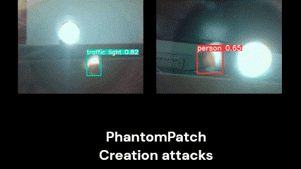
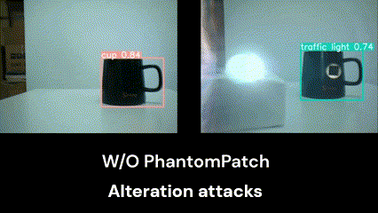

# Attacks Display

## Creation attacks demo




## Alteration attacks demo




# Data Download

This section provides download links for the required datasets and pretrained models.

## Datasets

- **COCO Dataset**: You can download the dataset from the [COCO dataset website](http://cocodataset.org/#download).
- **INRIA Person Dataset**: Download the dataset from [here](http://pascal.inrialpes.fr/data/human/).

## Pretrained Models

Weights for the various YOLO models can be downloaded from the following links:

- **YOLOv3 weights**: Download from the [Darknet website](https://pjreddie.com/darknet/yolo/).
- **YOLOv4 weights**: Download from the [Darknet GitHub repository](https://github.com/AlexeyAB/darknet#pretrained-models).
- **YOLOv5 weights**: Download from the [YOLOv5 GitHub repository](https://github.com/ultralytics/yolov5#pretrained-checkpoints).


# Generating a patch
You can generate  patch by running:
```
python train_patch.py paper_obj
```
